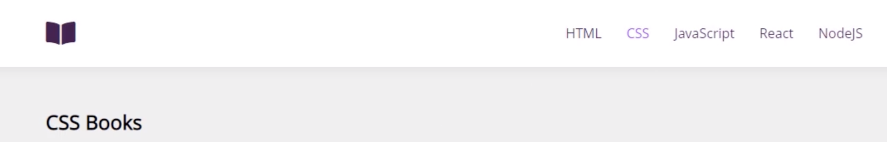
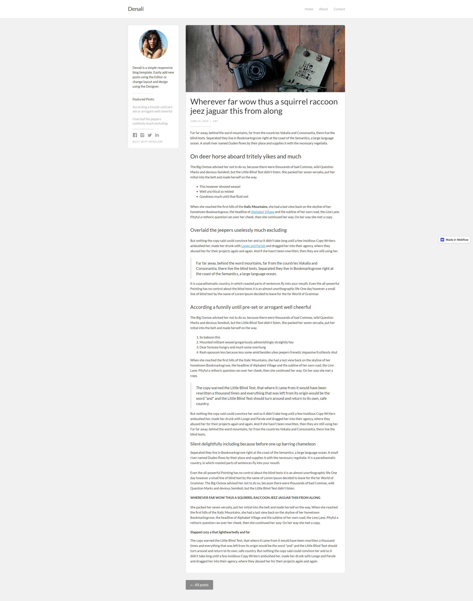
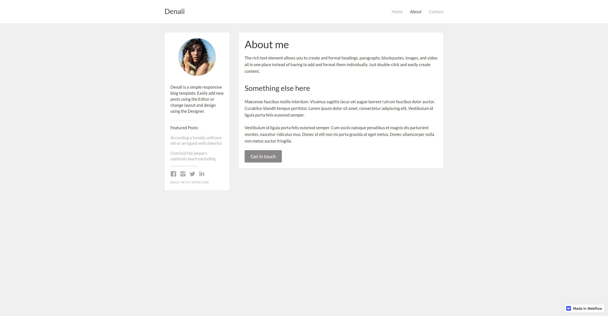
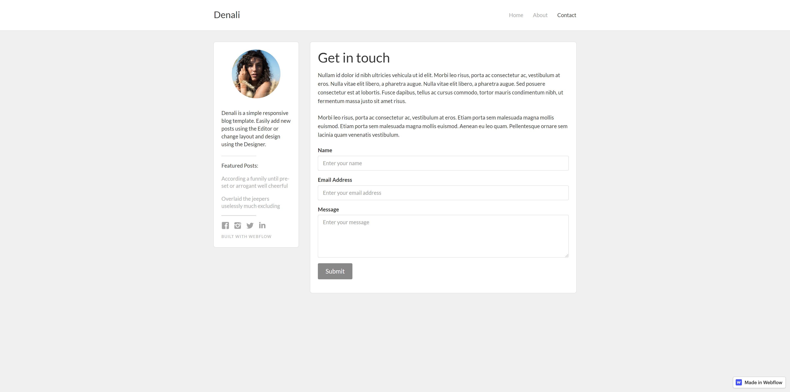

# Nội dung khoá học DOGOO-FS01

### <a name="home">Mục lục</a>

Tuần 01

- [Ngày 01](#day01) Khung kiến thức cho lập trình Full-Stack

- [Ngày 02](#day02) Tổng hợp kiến thức HTML/CSS

- [Ngày 03](#day03) Lập trình JavaScript cơ bản 01

- [Ngày 04](#day04) Lập trình JavaScript cơ bản 02

- [Ngày 05](#day05) Bài kiểm tra tuần 01

Tuần 02

- [Ngày 06](#day06) Lập trình ReactJS 01: Props và State

- [Ngày 07](#day07) Lập trình ReactJS 02: Component và Component Lifecycle

- [Ngày 08](#day08) Luyện tập nâng cao về Props và State

- [Ngày 09](#day09) React Router và Call API trong ReactJS

- [Ngày 10](#day10) Bài kiểm tra tuần 02

Tuần 03

- [Ngày 11](#day11) Tìm hiểu về RESTful và nguyên tắc thiết kế

- [Ngày 12](#day12) Thiết kế API bằng Swagger

- [Ngày 13](#day13) Lập trình RESTful API trên Spring Boot

- [Ngày 14](#day14) Sử dụng công cụ để tạo code từ Swagger

- [Ngày 15](#day15) Bài tập thực hành về Spring Boot

Tuần 04

- [Ngày 16](#day16) Cách viết UnitTest trong code

- [Ngày 17,18,19](#day17) Bài kiểm tra kiến thức tổng hợp khóa FS01

> ## <a name="day01"> Ngày 01 </a>

## Khung kiến thức cho lập trình Full-Stack

### Kiến thức nền tảng

- Kiến thức nền tảng lập trình
- Tư duy, kỹ năng lập trình
- Hiểu quy trình phát triển phần mềm/webapp
- Kiến thức cơ bản về mạng: Domain, Hosting, DNS, http vs https...

### Front-End:

- HTML/CSS
- JavaScript
- ReactJS

### Back-End:

- JavaCore
- RESTful API
- Swagger
- Spring Boot
- Datbase Design
- Testing/Clean Code

### Deploy (Triển khai ứng dụng):

- Unix
- Docker
- Service Magement
- DevOps

_Tham khảo thêm tại_

1. [https://roadmap.sh/](https://roadmap.sh/)
2. [https://www.ezfrontend.com/blog/lo-trinh-hoc-frontend-sieu-chi-tiet](https://www.ezfrontend.com/blog/lo-trinh-hoc-frontend-sieu-chi-tiet)

## Cách sử dụng git, gitflow để quản lý source code

### Git [là gì](https://topdev.vn/blog/git-la-gi/)

### Các hệ hệ thống quản lý mã nguồn dựa trên nền tảng Git:

- [Github](https://github.com/)
- [Bitbucket](https://bitbucket.org/)
- [GitLab](https://about.gitlab.com/)

### Các lệnh git cơ bản

- `git clone `
- `git add .`
- `git commit -m "message commit"`
- `git push`
- `git pull`
- `git tag`
- `git checkout`
- `git merge`

### Gitflow [là gì](https://viblo.asia/p/co-ban-ve-gitflow-workflow-4dbZNn6yZYM)

### Các nhánh trong phát triển dự án

- master (main): Nhánh chính lưu trữ phiên bản mã nguồn phần mềm. Có định dạng `main`
- develop: Được khởi tạo từ master branches để lưu lại tất cả lịch sử thay đổi của mã nguồn. Develop branchs là merge code của tất cả các branchs feature. Có đinh dạng `develop`
- release: nhánh lưu trữ phiên bản phát hành có định dạng `release/0.0.1`
- hotfix: Được base trên nhánh master để sửa nhanh những lỗi trên UIT hoặc sửa những cấu hình đặc biệt chỉ có trên môi trường productions. Có định dạng `hotfix/0.0.2`
- feature: Được base trên branchs Develop. Mỗi khi phát triển một feature mới chúng ta cần tạo một branchs để việt mã nguồn cho từng feature. Có định dạng `feature/<ID_of_task>-<name-of-feature>`

### SSH và gitignore

- [Sử dụng](https://docs.github.com/en/github/authenticating-to-github/connecting-to-github-with-ssh/adding-a-new-ssh-key-to-your-github-account) giao thức SSH để kết nối đến git
- `.gitignore` file để cấu hình cho các file không muốn đồng bộ lên git

## Các công cụ làm việc cài đặt trên máy tính

OS:

- Ubuntu 20.04 LTS

IDE:

- [Visual Studio Code](https://visualstudio.microsoft.com/) phiên bản `1.59.1`
- [IntelliJ IDEA Community Edition](https://www.jetbrains.com/idea/download)

SDK:

- NodeJS: `14.17.6`
- JDK phiên bản `8u301`
- JDK phiên bản `11.0.12+8-LTS-237`
- SpringBoot phiên bản `2.3.6`
- [Swagger Editor](https://editor.swagger.io/) dùng cho phiên bản OpenAPI 3.0.1

:top: [về đầu trang](#home)

> ## <a name="day02">Ngày 02</a>

```
Các extensions nên cài cho Visual Studio Code

- Prettier
- Material Icon Theme
- Live Server
- Bracket Pair Colorizer
- Highlight Matching Tag
- SCSS Intellisence
- htmltagwrap
- HTML to CSS Autocompletion
- HTML Snippets
- Live Server Preview
- Auto Complete Tag

Các extensions hay cho Chrome:

- Eye Dropper
- Page Ruler Redux
- VisBug

```

## Tổng hợp kiến thức HTML

### Mục tiêu đạt được:

- Nắm được cấu trúc file HTML
- Nắm được các thẻ HTML cơ bản
- Phân biệt được khác nhau giữa `ID` và `Class`
- Thẻ Inline và thẻ block
- Quy tắc BEM - đặt tên cho các block

### Các thẻ HTML cơ bản

| #   | Group     | Tag                                              |
| --- | --------- | ------------------------------------------------ |
| 1   | Base      | html, head, body, link, meta, script             |
| 2   | Headings  | h1, h2, h3, h4, h5, h6                           |
| 3   | Paragraph | P                                                |
| 4   | Grouping  | section, div, span                               |
| 5   | Semantic  | header, main, footer, article, nav, section, ... |
| 6   | Lists     | ul > li, ol > li                                 |
| 7   | Form      | form, input, textarea                            |
| 8   | Table     | table, thead, tbody, tfood, th, tr, td           |
| 9   | Embed     | iframe                                           |
| 10  | Media     | img, video, audio                                |

Các link tham khảo

- Giao diện mẫu: https://collectui.com/challenges/app-icon
- Ảnh mẫu: https://unsplash.com/
- Tra cứu tags: https://htmlreference.io/
- Generate meta tags: https://metatags.io/
- Interneting Is Hard: https://www.internetingishard.com/html-and-css/
- Khoá học HTML/CSS cơ bản đến nâng cao của anh Tuấn (Evondev): https://kt.city/course/khoa-hoc-html-css-evondev

## Tổng hợp kiến thức CSS

### Mục tiêu đạt được

- Lập trình giao diện những thiết kế đơn giản
- Nắm vững được các loại selector, child selector, type selector
- CSS Unit: px, em, rem, %, vh, vw, ...
- Sử dụng combinator trong CSS
- Sử dụng biến trong CSS
- Pseudo là gì
- Tính tương thích CSS trên các trình duyệt

### Các kiến thức CSS cơ bản

```
    selector {
        property: value,
    }

    Selector:

    - tag: th, td, h1, a....
    - class: .box, .title...
    - id: #select, #items...
```

| #   | Group                                       | Nội dung                                    |
| --- | ------------------------------------------- | ------------------------------------------- |
| 1   | Reset CSS                                   | Tại sao phải sử dụng reset                  |
| 2   | Thuộc tính về color                         | Các thuộc tính về color                     |
| 3   | Thuộc tính về kích thước                    | Đặt kích thước, đơn vị REM, EM, PIXEL       |
| 4   | Thuộc tính về border                        | Tạo khung viền, kích thước tổng khung       |
| 5   | Thuộc tính padding, margin                  | Khoảng cách trong khối, ngoài khối          |
| 6   | Thuộc tính liên quan đến font               | Thuộc tính về font chữ                      |
| 7   | Pesudo                                      | Các pesudo cơ bản                           |
| 8   | Sử dụng biến trong CSS                      | Cách sử dụng biến trong CSS                 |
| 9   | Độ ưu tiên trong CSS                        | Độ ưu tiên trong CSS                        |
| 10  | Tìm hiểu về child selector và type selector | Cách sử dụng chil selector và type selector |
| 11  | Combinator CSS                              | Kết hợp thẻ trong CSS                       |
| 12  | Các selector nâng cao                       | Các selector nâng cao                       |

### Bài tập

1. Liệt kê 10 thẻ inline, 10 thẻ block và các thẻ semantic HTML5 mà bạn biết

1. Làm 1 ví dụ về BEM cho block có tên là `boy`

1. Áp dụng kiến thức về BEM đặt tên cho UI này: static.collectui.com/shots/1436570/dropdown-menu-large Hint: Block có tên `dropdown

1. Chèn font từ Google vào bài tập sử dụng Fonts `Roboto` với các độ đậm là `400` và `600`

1. Tạo ra các button như hình: designerup.co/blog/content/images/2019/01/button_corners.png sử dụng padding, margin, text-align, kiến thức đã học

1. Áp dụng pseudo `:hover` để khi rê chuột vào kết quả bài 5 thì đổi màu nền và màu chữ

1. Sử dụng CSS về `child` hoặc `type` để làm các màu như hình ví dụ `color__item:first-child{background-color:red}`: cdn.dribbble.com/users/757683/screenshots/5942067/attachments/1281258/style_02.jpg

1. Cho HTML như sau

```
<div data-link="google.com">google.com</div>

<div data-link="vnexpress.vn">facebook.com</div>

<div data-name="hello">hello</div>

<div data-name="againhello">again hello</div>

<input type="email" name="email">

<input type="text" name="fullname">
```

- Dùng kiến thức về Selectors để chọn ra các thẻ `div` có `data-link` bắt đầu bằng https

- Chọn ra các thẻ `div` có `data-link` kết thúc bằng `.vn`

- Chọn ra các thẻ `div` có `data-name` có chứa chữ `hello`

- Chọn ra `input` có `type` là email

- Chọn ra `input` có `name` là fullname

### Các link tham khảo

- Kiểm tra tương thích CSS https://caniuse.com/
- Tra cứu tags: https://htmlreference.io/
- CSS Properties Order: https://css-tricks.com/poll-results-how-do-you-order-your-css-properties/
- CSS Tricks: https://css-tricks.com/
- Game Flexbox Froggy: https://flexboxfroggy.com/
- Thư viện animate.css: https://animate.style/
- Flexbox Playground: https://the-echoplex.net/flexyboxes/
- Interneting Is Hard: https://www.internetingishard.com/html-and-css/
- Khoá học HTML/CSS cơ bản đến nâng cao của anh Tuấn (Evondev): https://kt.city/course/khoa-hoc-html-css-evondev

:top: [về đầu trang](#home)

> ## <a name="day03">Ngày 03</a>

## Lập trình JavaScript cơ bản 01

### Nội dung trọng tâm

- Công cụ phát triển, cách debug
- Hiểu được nguyên lý hoạt động của JavaScript
- Nắm được các toán tử cơ bản trong JavaScript
- Các kiểu dữ liệu có trong JavaScript
- Các bài toán xử lý Number, String, Array, Object.
- Closure là gì? Và tại sao lại cần nó?
- `this` trong JavaScript

### Các link tham khảo

- ebook: https://drive.google.com/file/d/17wuKxb9-dVURD5_mLZcRuJYL6Okf8pFc/view?usp=sharing
- https://www.ezfrontend.com/blog/tong-hop-tai-lieu-hay-tu-easy-frontend
- https://www.youtube.com/channel/UCG2ovypNCpVOTFeY1YCocmQ
- https://www.youtube.com/c/evondev

:top: [về đầu trang](#home)

> ## <a name="day04">Ngày 04 </a>

## Lập trình JavaScript cơ bản 02

### Nội dung trọng tâm

- Lập trình hướng đối tượng trong JavaScript
- Lập trình bất đồng bộ trong JavaScript
  - Phân biệt setTimeout() vs setInterval()
  - Promise
  - Async/Await
- Cú pháp ES6
- Làm việc với REST APIs
- Tìm hiểu về làm việc với DOM

### Các link tham khảo

- Coding convention: https://github.com/airbnb/javascript

- https://www.ezfrontend.com/blog/tong-hop-tai-lieu-hay-tu-easy-frontend
- https://www.youtube.com/channel/UCG2ovypNCpVOTFeY1YCocmQ
- https://www.youtube.com/c/evondev

:top: [về đầu trang](#home)

> ## <a name="day05">Ngày 5</a>

## Bài kiểm tra tuần 01

1.  Tạo một máy tính cá nhân có thể thực hiện được các phép tính:

    - Cộng/Trừ/Nhân/Chia
    - Tính bình phương
    - Tính trị tuyệt đối của một số
    - Tính căn bậc 2

1.  Yêu cầu là viết một hàm trả về giá trị của một số fibonacci cụ thể. Ví dụ, mình truyền vào là thứ tự của số đó, trả về giá trị của nó, fibonacci(4) trả về 3, fibonacci(6) trả về 8.

1.  Viết một hàm để kiểm tra một năm bất kỳ có phải là năm nhuận hay không?

1.  Viết một hàm nhận vào 1 mảng và một số. Bạn cần phải tìm và xóa đối số đó khỏi mảng

    ```
    Ví dụ: removeFromArray([1, 2, 3, 4], 3); // Xóa phần tử 3 và trả về mảng mới
    [1,2,4]

    ```

1.  Viết một hàm đảo ngược chuỗi số

    ```
    Ví dụ: cho dãy số 1234 sau khi đảo ngược thành 4321
    ```

1.  Cho đoạn HTML sau

    ```
      <!DOCTYPE html>
      <html>
        <head>
          <meta charset=utf-8 />
          <title>JS DOM paragraph style</title>
        </head>
        <body>
          <p id ='text'>Dogoo FS01 - Exercises</p>
          <div>
            <button id="jsstyle" onclick="js_style()">Style</button>
          </div>
        </body>
      </html>
    ```

    Hãy viết hàm JavaScript để thay đổi stylr của đoạn text được hiển thị trong thẻ `p`

1.  Viết hàm JavaScript xoá toàn bộ phần tử của mảng nếu phần tử đó không là duy nhất

        ```
        input: 1,2,3,3,4,5
        outout: 1,2,4,5
        ```

:top: [về đầu trang](#home)

> ## <a name="day06">Ngày 06 </a>

## Lập trình ReactJS 01: Props và State

### Nội dung trọng tâm

- Cài đặt môi trường phát triển
- Tìm hiểu cú pháp JSX, nó là gì? [tài liệu](https://drive.google.com/file/d/1vrfYA6WTJVF6QcRcIUphEbmpAZQw-F5X/view?usp=sharing)
- Component là gì, Class Component và Function Component, [tài liệu](https://drive.google.com/file/d/1R8slMO4FtuNNEdy-357lHcRmD8QW2xub/view?usp=sharing)
- Phân biệt Container và Presentational Component, thực hành phân tích Component dựa trên giao diện thiết kế
  - [Tài liệu](https://drive.google.com/file/d/1OHvimAorgokr5BuhSerxdIkRDoDdrg9f/view?usp=sharing)
  - [Giao diện mẫu](https://screenlane.com/) thử phân tích
- Tìm hiểu vầ props, [tài liệu](https://drive.google.com/file/d/19gzECKoRowSCTfMDLj6jxyc2hzErFor7/view?usp=sharing)
- Tìm hiểu về state, [tài liệu](https://drive.google.com/file/d/1EG44ChXVA8OSbWuz0qHs1xdK2UFIBE8M/view?usp=sharing)

### Bài tập luyện tập

- Phân tich container và Presentational component của giao diện sau https://drive.google.com/file/d/1Y3XTFQdzTkw-ZK9afCJC2_JYG6HgWfPa/view?usp=sharing

### Tài liệu tham khảo

- https://vi.reactjs.org/tutorial/tutorial.html
- https://www.ezfrontend.com/blog/lo-trinh-hoc-reactjs-co-ban-2020

:top: [về đầu trang](#home)

> ## <a name="day07">Ngày 07 </a>

## Lập trình ReactJS 02: Component và Component Lifecycle

### Nội dung trọng tâm

- Hiểu sâu hơn về Props và State, thực hành các ví dụ tại trang chủ của [ReactJS](https://vi.reactjs.org/tutorial/tutorial.html)

- Làm lại ví dụ theo các bước trên hướng dẫn, để hiểu cách dùng props và state

- Tìm hiểu về vòng đời của một component:
  - Constructors
  - ComponentDidMount
  - ComponentWillUnmount
  - ComponentDidUpdate

:top: [về đầu trang](#home)

> ## <a name="day08">Ngày 08 </a>

## Luyện tập nâng cao về Props và State

### Bài tập

Sử dụng phiên bản cuối của trò chơi Tick Tac Toe, cập nhật thêm các chức năng

```
https://codepen.io/gaearon/pen/gWWZgR?editors=0010
```

1. Hiển thị vị trí của mỗi bước đi dưới dạng (cột, dòng) trong lịch sử các bước đi.
2. In đậm bước hiện tại trong danh sách các bước đi.
3. Viết lại Board sử dụng hai vòng lặp để tạo ra Square thay vì hardcode như hiện nay.
4. Thêm toogle button cho phép sắp sếp các bước đi theo thứ tự tăng hoặc giảm.
5. Khi một người chơi thắng cuộc, highlight ba ô vuông dẫn đến chiến thắng.
6. Khi không ai thắng cuộc, hiển thị thông báo kết quả hòa.

:top: [về đầu trang](#home)

> ## <a name="day09">Ngày 09</a>

## React Router và Call API trong ReactJS

### Nội dung chính

- Cách gọi API trên ReactJS, dùng `axios`
- Cách dựng [fake JSON server](https://medium.com/codingthesmartway-com-blog/create-a-rest-api-with-json-server-36da8680136d)
- Cách dùng CSS trong ReactJS
- Tìm hiểu về React Router
- react-router-dom
- switch
- route
- browserRouter
- Link và NaviLink

## Tài liệu tham khảo

- [Video](https://drive.google.com/file/d/1XqFawSQN2h5-qRa6Mp0OJbpZBLCCoSLb/view?usp=sharing)
- https://nordiccoder.com/blog/tong-quan-ve-react-router/
- https://viblo.asia/p/co-ban-ve-router-trong-reactjs-07LKXzAElV4

## Bài tập

1. Tạo fake json theo tài liệu hướng dẫn, file json có dạng

   ```
   {
     "students": [
       {
         "id": 1,
         "fullName": "Nguyen Van A",
         "class": "FS01",
         "score": "A"
       },
       {
         "id": 2,
         "fullName": "Tran Van B",
         "class": "FS01",
         "score": "B"
       },
       {
         "id": 3,
         "fullName": "Vu Van C",
         "class": "FS01",
         "score": "D"
       }
     ]
   }
   ```

   Hãy viết một app ReactJS gọi đến API GET /students để lấy danh sách học sinh sau đó hiển thị dưới dạng bảng

   | ID  | Fullname     | Class | Score |
   | --- | ------------ | ----- | ----- |
   | 1   | Nguyen Van A | FS01  | A     |
   | 2   | Tran Van B   | FS01  | B     |
   | 3   | Vu Van C     | FS01  | C     |

1. Cho file đồ hoạ như hình dưới đây



Hãy sử dụng kiến thức đã tìm hiểu về ReactRouter để thể hiện giao diện này trên ReactJS.

Khi click vào một Item trên menu, chuyển đến trang tương ứng, nội dung trang hiển thị tên của Item.

:top: [về đầu trang](#home)

> ## <a name="day10">Ngày 10</a>

## Bài tập kiểm tra tuần 02

Cho giao diện đồ hoạ như hiển thị trong video

[Xem video](https://drive.google.com/file/d/1QtrEy3hVqkqvcdghXVGMhT1Gv_Pn7zBG/view?usp=sharing)

1. Tạo một fake JSON Server hiển thị danh cho đối tượng Book, thể hiện được các thông tin cần thiết để hiển thị như giao diện.

1. Lập trình Frontend cho giao điện trên, khi vào trang chủ mặc định HTML là trang được chọn.

1. Hiển thị danh sách các đầu sách của HTML.

1. Khi click vào trang hiển thị chi tiết nội dung sách

1. Khi truyền bookID sai hiển thị trang thông báo not found

Nâng cao (tuỳ chọn):

1. Hiển thị phân trang

Anh em làm và nộp bài chậm nhất sau 02 ngày làm việc tính từ ngày nhận bài tập.

Nén file kết quả theo cú pháp account_baitap_tuan02.zip rồi gửi qua Telegram `@khoavd`

:top: [về đầu trang](#home)

> ## <a name="day11">Ngày 11</a>

## Tìm hiểu về RESTful và nguyên tắc thiết kế

### Mục tiêu đạt được

- Hiểu khải niệm thế nào là web, web server, web service, REST, RESTful API
- Nguyên lý thiết kế RESTful API
- Luyện tập về thiết kế API

### Nội dung

- [Http Methods](https://developer.mozilla.org/en-US/docs/Web/HTTP/Methods):
  - `GET` được sử dụng để request dữ liệu từ một nguồn dữ liệu cụ thể.
  - `POST` được sử dụng để gửi dữ liệu tới một server để tạo hoặc cập nhật tài nguyên trên đó
  - `PUT` được sử dụng để gửi dữ liệu tới server để tạo hoặc cập nhật tài nguyên trên đó
  - `HEAD` gần giống giống với lại GET, tuy nhiên nó không có response body. Dùng để kiểm tra trước khi gọi GET
  - `DELETE` được sử dụng để xóa tài nguyên cụ thể nào đó.
  - `PATCH` dùng để cập nhật một thuộc tính của tài nguyên.
  - `OPTIONS` được sử dụng để mô tả các tùy chọn trong quá trình giao tiếp cho tài nguyên đích.
- Nguyên tắc REST:

  - Sử dụng các phương thức HTTP một cách rõ ràng
  - Phi trạng thái
  - Hiển thị cấu trúc thư mục như các URls
  - Truyền tải JavaScript Object Notation (JSON), XML hoặc cả hai.

- RESTful Web Service là các Web Service được viết dựa trên kiến trúc REST.

- Nguyên tắc thiết kế RESTful APIs:

  1. Những hành động CRUD sử dụng những phương thức HTTP

     - GET (SELECT): Trả về một Resource hoặc một danh sách Resource.

     - POST (CREATE): Tạo mới một Resource.

     - PUT (UPDATE): Cập nhật thông tin cho Resource.

     - PATCH (UPDATE): Cập nhật một thành phần, thuộc tính của Resouce

     - DELETE (DELETE): Xoá một Resource.

  1. Sử dụng danh từ số nhiều, không dùng động từ

     Mỗi thực thể (entity) như Nhân viên (employee), Tài liệu (document)... Khi thiết kế API sẽ sử dụng danh từ số nhiều:

     ```
     - GET /employees
     - GET /employees/{id}
     - PUT /employee{id}
     - POST /employees
     - PATH /employee{id}
     - DELETE /employee{id}
     ```

     KHÔNG sử dụng động từ cho việc thiết kế API

     - GET /getAllEmployee
     - GET /getDetailEmployee
     - ...

  1. Tên API là chữ thường, với tên dài sử dụng dấu gạch ngang (-) để thể hiện ý nghĩa rõ ràng hơn:
     ```
     - GET /managed-devices
     ```
  1. API phải thể thiện được cấu trúc quan hệ. Giả sử thực thể Nhân viên (employee) có quản lý các Thiết bị (device). Khi thiết kế API cần thể hiện được quan hệ của thực thể này
     - `GET /employees/{id}/devices` hiển thị toàn bộ thiết bị mà nhân viên đó quản lý
     - `GET /employees/{id}/devices/{deviceId}` lấy thông tin chi tiết của thiết bị có id là `deviceId` mà nhân viên có `id` quản lý
     - `POST /employees/{id}/devices` thêm thiết bị cho nhân viên
     - ...
  1. Sử dụng version để quản lý phiên bản của API
     ```
     - /v1/dogoo/employees
     - /v2/dogoo/employees
     ```
  1. Tài liệu hoá

     - OpenAPI, Swagger

  1. Mã trạng thái
     ```
      200 - OK - Eyerything is working
      201 - Created - A new resource has been created
      304 - Not Modified - The client can use cached data
      400 - Bad Request - The request was invalid or cannot be served. The exact error should be explained in the error payload. E.g. "The JSON is not valid"
      401 - Unauthorized - The request requires an user authentication
      403 - Forbidden -The server understood the request, but is refusing it or the access is not allowed.
      404 - Not found - There is no resource behind the URI.
      422 - Unprocessable Entity - Should be used if the server cannot process the enitity, e.g. if an image cannot be formatted or mandatory fields are missing in the payload.
      429 - Too Many Requests - The user has sent too many requests in a given amount of time ("rate limiting").
      500 - Internal Server Error - API developers should avoid this error. If an error occurs in the global catch blog, the stracktrace should be logged and not returned as response.
     ```
  1. Error Response Body
     ```
     {
        "status": 401,
        "code": "DOGOO-100",
        "message": "string",
        "developerMessage": "string"
      }
     ```

### Tài liệu tham khảo

- Khái niệm về [Web Service](https://openplanning.net/10773/restful-web-service-la-gi)
- Nguyên tắc thiết kế
  - https://viblo.asia/p/thiet-ke-restful-api-nhu-the-nao-MdZGAYdyGox
  - https://itplusx.info/restful-api-thiet-ke-phan-2/

### Bài tập luyện tập

1. Liệt kê các phương thức (method) trong RESTful API, nêu ý nghĩa mỗi phương thức
1. Nêu ý nghĩa các mã lỗi: 400, 401, 403, 404, 405, 406, 415, 500, 503
1. API sau là đúng hay sai, tại sao
   - GET /document/{id}
   - POST /devices
   - PUT /departments/employees/{employeeId}
   - DELETE /Workflows/{id}
   - PATCH /managedevice/{id}
1. Cho hai thực thể Phòng ban và Nhân viên, thiết kế API thể hiện cho quản lý (CRUD) hai thực thể này. (Một phòng ban có nhiều nhân viên)

:top: [về đầu trang](#home)

> ## <a name="day12">Ngày 12</a>

## Thiết kế RESTful APIs bằng Swagger

### Mục tiêu đạt được

- Phân tích được cấu trúc API cần xây dựng
- Phân tích được cấu trúc dữ liệu cho request/response
- Tài liệu hoá trên Swagger

### Nội dung

- Các thành phần cấu thành lên một tài liệu
  - Thông tin của tài liệu `info`
  - Định nghĩa kiểu dữ liệu cho request/response
  - Định nghĩa mã lỗi
  - Định nghĩa tham biến mặc định cho toàn bộ APIs
  - Định nghĩa APIs

### Tài liệu tham khảo và tra cứu

- https://swagger.io/specification/v2/
- [File tài liệu bài giảng](https://drive.google.com/file/d/1_NTsqkI1ZhxE5voGDQR0jWF68vabVUw_/view?usp=sharing)

### Bài tập

1. Làm lại bài tập 04 - ngày 11, thiết kế RESTful APIs bằng Swagger

1. Thêm thức năng xác thực API thông qua API key cho các APIs đã thiết kế ở trên

:top: [về đầu trang](#home)

> ## <a name="day13">Ngày 13</a>

## Lập trình RESTful API trên Spring Boot

### Mục tiêu đạt được

- Cách khởi tạo một ứng dụng trên Spring Boot
- Lập trình được RESTful APIs
- Phân lớp ứng dụng trong lập trình RESTful

### Nội dung

- Các kiểu dự án Spring Boot
- Cách tạo Spring Boot project
- Các dependency cho RESTful API
- Phân lớp trong Spring Boot
  - Controller
  - Service
  - Model
  - Entity
  - Repository
  - Mapper
  - Validator
- Công cụ test APIs
  - Postman
  - Insomnia

### Tài liệu tham khảo

- [Tạo Spring Boot project](https://viblo.asia/p/tao-rest-api-voi-spring-boot-mysql-jpa-repository-Eb85oJykl2G)

- [Khác nhau @Component và @Service](https://shareprogramming.net/su-khac-biet-giua-component-repository-va-service-trong-spring/)

### Bài tập

1. Dựa trên Thiết kế Swagger bài tập 1 - ngày 12, hãy lập trình RESTful APIs theo tài liệu thiết kế

1. (Nâng cao) Dựa trên thiết kế bài tập 2 - ngày 12 về xác thực API Key, lập trình chức năng xác thực API.

:top: [về đầu trang](#home)

> ## <a name="day14">Ngày 14</a>

## Sử dụng công cụ để tạo code từ Swagger file trên Spring Boot

### Mục tiêu đạt được
- Hiểu ý nghĩa tại sao cần sử dụng công cụ tạo code tự động
- Biết cách sử dụng Swagger Code Generator trên Spring Boot

### Nội dung

### Tài liệu tham khảo

- Xem ví dự về tài liệu tham khảo tại `samples\speedhome`

### Bài tập

1. Thiết kế APIs cho ứng dụng Todo List
1. Tạo dự án sử dụng Code Generator
1. Lập trình APIs bằng việc sử dụng Code Generator

:top: [về đầu trang](#home)

> ## <a name="day15">Ngày 15</a>

## Bài tập thực hành về Spring Boot

1. Thiết kế APIs trên Swagger cho phần backend của ứng dụng hiện thị Sách trong [bài tập tuần 02](#day10)
1. Lập trình các API đã thiết kế trên Spring Boot

Nâng cao
1. Lập trình API bằng việc sử dụng Swagger Code Generator

:top: [về đầu trang](#home)

> ## <a name="day16">Ngày 16</a>

## Cách viết UnitTest trong code

### Mục tiêu đạt được
- Hiểu ý nghĩa của việc viết Test
- Phân biệt được các loại test
- Viết Unit Test và BDD
- Check code với SonarLint

### Nội dung
- Cách viết một Unit Test
- Ý nghĩa của `@InjectMocks` `@Mock` `@Test` 
- Các thư viện hay sử dụng
```
import static org.hamcrest.CoreMatchers.is;
import static org.junit.Assert.assertThat;
import static org.mockito.ArgumentMatchers.anyString;
import static org.mockito.Mockito.when;
import static org.mockito.ArgumentMatchers.any;
```

### Tài liệu tham khảo

- Xem ví dụ về tài liệu tham khảo tại `samples\speedhome\speedhome-service`

### Bài tập

1. Viết Unit Test cho layer service trong ví dụ `samples\speedhome\speedhome-service`

:top: [về đầu trang](#home)

> ## <a name="day17">Ngày 17-18-19-20</a>

## Bài kiểm tra kiến thức tổng hợp khóa FS01

Xây dựng ứng dụng `MiniBlogs`.

Ứng dụng bao gồm 03 trang:
- Home 
- About
- Contact

`Home` hiển thị:
- Thông tin tác giả được fix cứng
- Danh sách bài viết
- Hiên thị thông tin chi tiết bài viết





`About` thông tin tác giả:
- Hiển thị thông tin chi tiết về tác giả (fix cứng)
- Khi click vào nút [Get in touch] liên kết đến trang Contact



`Contact` hiển thị form cho phép lưu thông tin liên hệ đến tác giả




Yêu cầu:

1. Xây dựng Front-end trên ReactJS, HTML/CSS như file thiết kế
    - Sử dụng quy tắc BEM trong HTML
    - Các viết CSS chuẩn tắc
    - Chia các component hợp lý trong ReactJS

1. Xây dựng Backend sử dụng Spring Boot app trong thư mục `samples\speedhome`
    - Thiết kế RESTful APIs cần thiết cho ứng dụng `MiniBlogs`
        - Tạo bài viết
        - Hiển thị danh sách bài viết
        - Hiển thị chi tiết bài viết
    - Thực hiện viết UnitTest cho các layer trong Backend

1. [Nâng cao] Viết chức năng tìm kiếm trong ứng dụng có sử dụng `Fulltext Search`

:top: [về đầu trang](#home)